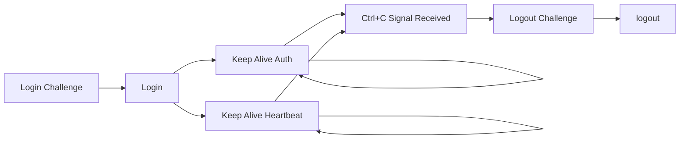
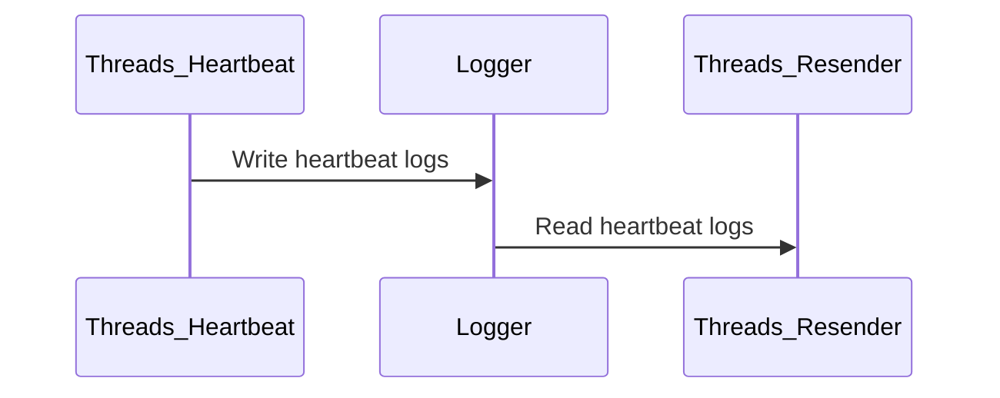

# 吉林大学校园网认证客户端(C语言版)

基于学校官方提供的Linux认证客户端编写，适用于支持POSIX标准的环境(Linux,BSD,Cygwin...)

## 客户端编写初衷

主要是为了缓解以下问题

1. 学校官方仅提供图形界面客户端
2. GitHub的C/C++轮子过旧，校园网UDP丢包断线
3. 运行在Java和Python解释器上的客户端过于臃肿

## 校园网认证协议

吉林大学校园网采用DRCOM D版认证协议(UDP)，主要包括关于DRCOM协议的具体内容请参考[GitHub DRCOM仓库](https://github.com/drcoms)

## 客户端执行流程



1. 发送登录challenge，获取salt用于登录
2. 使用salt构建登录数据包进行账号登录
3. 发送两种心跳包保持在线，同时程序监听linux命令行的Ctrl+C信号(SIGINT)
4. 收到SIGINT信号，执行下线流程，发送下线challenge后获取salt进行下线

## 客户端实现

1. 主进程完成上述1,2步骤后启动两个独立的线程(pthread)发送不同的心跳包
2. 实测UDP协议在校园网环境下会有丢包，导致认证服务器收不到心跳包使客户端下线，为了缓解UDP的丢包问题，客户端使用日志记录器Logger记录上一轮发送的心跳包、发送时间、发送数以及回复数，使用Resender监视日志，如果心跳包在发送后2秒后未收到服务器应答则进行重发，重试3次无应答后退出客户端，Render为2个独立线程分别负责两种心跳包的重发



## 如何使用

### 下载代码库

```bash
git clone https://github.com/AndrewLawrence80/jlu-drcom-client.git
```

### 修改配置

修改 ``config.h``

``` cpp
#define CONFIG_USERNAME "xiaoming22" // 邮箱账户，无@后缀
#define CONFIG_PASSWORD "xiaoming123456" // 邮箱密码
#define CONFIG_IP "192.168.1.100" // 校园网IP
#define CONFIG_MAC "\x00\x00\x00\x00\x00\x00" // 校园网IP关联的MAC地址
#define CONFIG_HOST_NAME "xiaoming-linux" // 主机名，linux可以在命令行运行hostname
#define CONFIG_OS_INFO "5.10.0-amd64" // 操作系统版本，linux可以在命令行运行uname -r
```

### 安装依赖

Debian/Ubuntu

```bash
sudo apt install build-essential binutils linux-headers-amd64 make gcc
```

### 本地编译

为代码所在的机器/相同指令集的机器编译

```bash
make
```

### 交叉编译

为不同指令集的机器编译，以openwrt为例

#### 下载交叉编译SDK

在[Openwrt下载页面](https://downloads.openwrt.org/snapshots/targets/)下载对应指令集的SDK，例如[MT7621SDK](https://downloads.openwrt.org/snapshots/targets/ramips/mt7621/openwrt-sdk-ramips-mt7621_gcc-12.3.0_musl.Linux-x86_64.tar.xz)，解压

#### 修改Makefile

``` Makefile
export PATH := $(PATH):[解压路径]/openwrt-sdk-[版本]-[指令集]_gcc-[gcc版本]_[libc版本].Linux-x86_64/staging_dir/toolchain-[指令集]_gcc-[gcc版本]_[libc版本]/bin/
export STAGING_DIR := [解压路径]/openwrt-sdk-[版本]-[指令集]_gcc-[gcc版本]_[libc版本].Linux-x86_64/staging_dir/toolchain-[指令集]_gcc-[gcc版本]_[libc版本]/
CC=[上述toolchain/bin目录下的gcc]
LD=[上述toolchain/bin目录下的ld]
# CC=gcc
```

更多关于Openwrt下的编译参考[Openwrt官方文档](https://openwrt.org/docs/guide-developer/toolchain/crosscompile)

### 保持在命令行运行

Linux下使用[Screen](https://linuxize.com/post/how-to-use-linux-screen/)

## 鸣谢

[GitHub DRCOMS](https://github.com/drcoms/drcom-generic)
[GitHub ly0](https://github.com/ly0/jlu-drcom-client)
[GitHub mchome](https://github.com/mchome/dogcom)
[Github Yesterday17](https://github.com/Yesterday17/go-drcom-jlu)
[Github youthlin](https://github.com/youthlin/jlu-drcom-client)

## 关于Issue

[提问的智慧](https://github.com/ryanhanwu/How-To-Ask-Questions-The-Smart-Way/blob/main/README-zh_CN.md)

1. 详细描述你的问题
2. 复现方法
3. 程序日志
